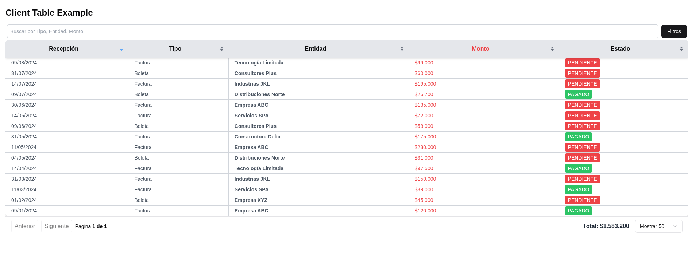

# 🧱 components-library

Este repositorio contiene una colección de componentes reutilizables, diseñados para integrarse fácilmente en distintos proyectos.

---

## 🚀 ¿Qué incluye?

- ✅ Componentes reutilizables (tablas, filtros, inputs, etc.)
- ✅ Documentación en `README.md` por componente
- ✅ Ejemplos funcionales (`/example`)
- ✅ Página de inicio con índice de todos los componentes
- ✅ Visor de documentación integrado

---

## 📦 Tecnologías utilizadas

- **TypeScript**
- **Tailwind CSS**
- **ShadCN UI**
- **Next.js** (estructura `app/`)
- **@tanstack/react-table**

---

## 🧩 Componentes disponibles

| Componente            | Descripción                                                                                                   | Vista previa                                                                 |
|-----------------------|---------------------------------------------------------------------------------------------------------------|------------------------------------------------------------------------------|
| **Tabla de frontend** | Tabla donde la búsqueda, filtros y ordenamiento se manejan en el frontend. Ideal para volúmenes moderados. Incluye filtros por texto, fechas, dropdowns y sumatoria de columnas.  |    |

---
